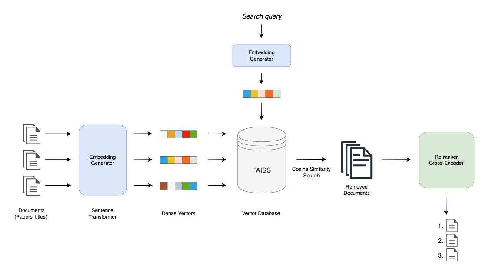

# Semantic Search

A simple semantic search engine that retrieves similar documents given their cosine similarity and performs a re-ranking of the retrieved documents with a cross-encoder Transformer for better performance. The code also make use of Facebook AI Similarity Search (FAISS) to store and index the embeddings for a fast retrieval, without indexing them every time you run the code.

## Architecture


###
Generating the embeddings:

```python3 sentence_embeddings.py "/path to your dataset.csv" "/path for the generated embedding file.pkl"```

This script, depending on the dataset size, can take a lot of time to compile, as it need to compute sentence embeddings for all documents in your dataset.

###
Performing the semantic search:

```python3 main.py "/path to your dataset.csv" "/path to your generated embeddings.pkl" ""path to your generated index.index"```

In you terminal you can then input your query and you will immediately get your top k results.

**Important!**
This script can serve as a basis for Retrieval Augmented Generation (RAG) applications. Depending on you needs you can use different databases and/or embeddings.